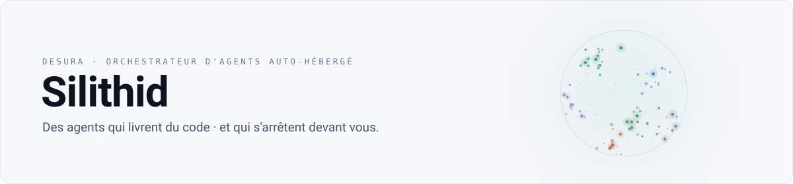
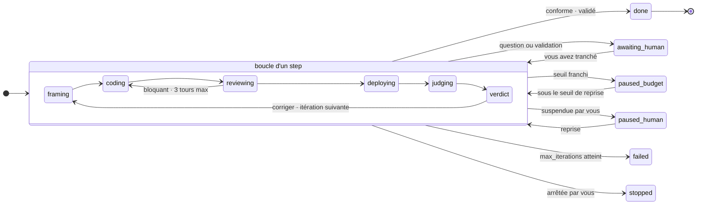
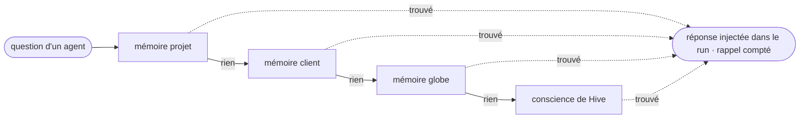

<picture>
  <source media="(prefers-color-scheme: dark)" srcset=".github/assets/banniere-sombre.svg">
  
</picture>

**Silithid orchestre des agents qui livrent du code · et s'arrête devant vous à chaque endroit où une erreur coûterait cher.**

[](https://github.com/DesuraWeb/hivemind/actions/workflows/ci.yml)


> `hivemind` est le nom du dépôt, `silithid` le nom de code interne · les deux désignent la même chose.

**Sommaire** · [Ce que ça fait](#ce-que-ça-fait) · [Les sept rôles](#les-sept-rôles) · [Les portes humaines](#les-portes-humaines) · [Ce qui est impossible](#ce-qui-est-impossible) · [La mémoire](#la-mémoire) · [L'exploitation](#lexploitation) · [Ce qui apprend tout seul](#ce-qui-apprend-tout-seul-et-ce-qui-ne-le-fait-pas) · [Ce qui est vrai](#ce-qui-est-vrai-et-ce-qui-ne-lest-pas) · [Démarrer](#démarrer) · [Architecture](#architecture) · [Licence](#licence)

## Ce que ça fait

Vous décrivez un step. Le **garant** le cadre et pose des critères d'acceptation vérifiables. Le **dev** code dans un worktree isolé et ouvre une PR. Le **reviewer** relit et boucle avec lui, borné à trois tours. Le **juge** capture les pages à trois viewports et décrit ce qu'il voit · il ne décide pas. Le garant tranche depuis les rapports, et rend un verdict.

Un **communicant** propose un email au client quand quelque chose est mis en ligne. Un agent d'**exploitation** parle aux serveurs : hébergement neuf préparé seul, machine en production touchée uniquement sur un plan que vous avez validé.

> [!NOTE]
> Un humain n'écrit pas le code : il arbitre. Rien ne part en production sans vous · rien n'est envoyé à un client sans vous · rien ne change sur un serveur qui sert déjà sans vous.



La boucle dev · reviewer est bornée, le nombre d'itérations aussi. Quand la limite est atteinte, rien n'est forcé : la boucle s'arrête et l'alerte attend votre décision.

## Les sept rôles

La colonne qui compte est la troisième. Chaque rôle est défini autant par ce qu'il ne peut pas faire que par ce qu'il fait.

| Rôle | Ce qu'il fait | Ce qu'il ne peut pas faire |
| --- | --- | --- |
| **Hive** | orchestre la boucle, route vers l'inbox tout ce qui exige un humain, écrit en mémoire ce que vous validez | écrire à un client · élargir un droit |
| **Garant** | cadre le step, pose des critères vérifiables, injecte les savoirs rappelés, tranche depuis les rapports | relire le code |
| **Dev** | code dans un worktree isolé, ouvre une PR, fait tourner les tests | se relire lui-même · fusionner sa PR |
| **Reviewer** | relit le diff, borne les risques, remarques typées mineur ou bloquant | juger le résultat · dépasser trois tours |
| **Juge** | capture 390 · 768 · 1440, compare au réel, décrit les écarts | décider · voir le code avant son rendu |
| **Communicant** | rédige les emails client, brouillons complets, décidables depuis l'inbox | envoyer quoi que ce soit |
| **Ops** | sonde les serveurs, prépare un hébergement neuf, propose des plans avec sauvegarde et retour arrière | exécuter une commande · sortir du catalogue |

## Les portes humaines

Tout ce qui exige un humain passe par une seule inbox, et chaque panneau porte de quoi trancher **sans ouvrir un terminal ni un autre onglet** : le brouillon complet avec son destinataire, le verdict avec ses captures, le plan serveur avec son retour arrière.

Six types d'items : **question** · **validation** · **verdict** · **alerte** · **passation** · **info**. Les validations se déclinent par objet : email, prod, savoir, fin de step, ops, recette.

## Ce qui est impossible

La section la plus importante de ce dépôt. Ces garanties ne sont pas des interdictions dans un prompt : l'impossibilité est dans le type ou le schéma, et chacune a son test.

| Un agent ne peut pas… | Le mécanisme qui rend ça structurel |
| --- | --- |
| envoyer un email | il rédige · l'envoi exige une preuve de validation humaine qu'il ne peut pas fabriquer |
| exécuter un outil hors de sa politique | c'est `tools` qui restreint, pas `allowedTools` · ça s'est découvert à la dure · un nom absent de la table n'existe pas, il n'est pas « bloqué » |
| emprunter une fiche client entre globes | la table d'emprunt ne peut pas la désigner · un savoir, lui, s'emprunte · avec votre accord |
| toucher les règles en silence | une PR qui modifie la machine à états ou la politique d'outils lève un item distinct · pas un blocage, l'impossibilité de passer inaperçu |
| exécuter une commande serveur | l'agent d'exploitation rend un plan inerte · catalogue fermé, sans `shell`, `exec` ni `run` · le schéma de sortie n'accepte aucun autre nom |
| exécuter autre chose que le plan montré | le plan est figé dans l'item d'inbox avec son empreinte · modifié après validation, il est refusé au lieu d'être appliqué |
| déclarer un serveur « vierge » | vierge se **mesure** : cinq preuves, une seule incertitude conclut « en service » · et un serveur passé en service ne redevient jamais vierge, c'est un trigger, pas une règle applicative |

**Interdit se contourne. Impossible, non.**

## La mémoire

Une question traverse quatre cercles, du plus spécifique au plus général · le premier qui sait répond, sujet par sujet.



- Un savoir est **versionné** · le corriger crée une version, l'ancienne reste lisible.
- **Votre formulation fait foi**, jamais celle de l'agent.
- Les globes sont **étanches** · un savoir s'emprunte en lecture (il suit son prêteur) ou en copie (il vit sa vie), et ça passe par vous. Une fiche client ne s'emprunte jamais.
- Chaque rappel **incrémente un compteur** (`savoirs.rappels`) · il repère les savoirs qu'aucun agent n'a jamais servis, et une revue vous les remet sous les yeux quand la file grandit ou qu'un mois a passé.

## L'exploitation

Ce n'est pas à qui appartient le serveur qui décide de l'autonomie, c'est **ce qu'il y a déjà dessus**. Un serveur mesuré vierge s'installe sans rien demander · il n'y a rien à casser. Un serveur qui sert déjà reçoit un plan : opérations du catalogue uniquement, chacune avec sa commande exacte, sa sauvegarde, son retour arrière · ce qui ne se défait pas en premier. Vous validez, Silithid applique, et ce qui s'exécute est ce qui vous a été montré, vérifié par empreinte.

## Ce qui apprend tout seul, et ce qui ne le fait pas

- **Le savoir s'accumule sans rien demander.** Une recette de déploiement s'enrichit de trois signaux : ce que le juge a trouvé, ce que vous avez corrigé en validant, ce qui a cassé.
- **Le pouvoir ne s'élargit que par une décision humaine.** Une recette gagne des rappels toute seule · c'est du texte, ça informe. Elle ne gagne une étape qui s'exécutera d'office que si vous l'avez approuvée.
- Une étape ne peut jamais introduire une opération absente du catalogue · ça, c'est un commit.
- Le quinzième déploiement d'une stack n'est plus le premier. Et il ne s'accorde pas de droits en chemin.

## Ce qui est vrai, et ce qui ne l'est pas

Ce dépôt évite une chose avec obstination : afficher ou promettre un état qu'il n'a pas. Une jauge sans mesure dit « inconnu » plutôt que zéro · un bouton sans destinataire est absent, pas grisé · une capture en erreur ne devient jamais un rapport de juge. Ce README suit la même règle.

**Vrai aujourd'hui :**

- La boucle tourne de bout en bout, avec de vrais modèles, sur un vrai dépôt.
- Trois boucles avancent en parallèle (`LOOP_CONCURRENCY`) · chiffre calé sur la RAM disponible et l'absence de swap, pas choisi au hasard.
- La mémoire apprend, rappelle, compte ses rappels, et déclenche la revue.
- L'agent d'exploitation est complet · sonde, catalogue, plans, sauvegardes, retours arrière · testé contre un faux serveur.

> [!WARNING]
> Pas encore :
>
> - Le déploiement se fait sur un **aperçu local** · le staging réel est écrit (`DeployTarget` + une cible SSH/git) mais n'a jamais tourné contre un vrai serveur.
> - Gmail fonctionne en **brouillon seulement** · il n'a jamais parlé au vrai Gmail.
> - L'agent d'exploitation **n'a jamais touché une vraie machine**.

## Démarrer

Prérequis : Node 22 · pnpm · PostgreSQL 16 · Chromium pour Playwright (`pnpm exec playwright install --with-deps chromium`).

```bash
git clone https://github.com/DesuraWeb/hivemind && cd hivemind
pnpm install
cp .env.example .env        # puis remplir · scripts/setup.sh génère les clés
pnpm db:migrate && pnpm db:seed
pnpm db:createuser florian  # le premier compte · sans lui, l'écran de connexion est infranchissable
pnpm dev                    # API sur :3000
pnpm dev:web                # front sur :5173
```

Le mot de passe est demandé à l'invite, jamais passé en argument : les
arguments d'un processus sont lisibles via `ps` et restent dans l'historique du
shell. Entrée redirigée, il est lu sur `stdin` · utilisable depuis un playbook
sans exposer le secret pour autant.

Production : `pnpm build && pnpm start` · un seul processus sert l'API et le front. Voir [docs/exploitation/deploiement.md](docs/exploitation/deploiement.md).

**Aucun globe n'existe à l'installation** : l'écran Globes vous invite à créer le premier. C'est petit, et ça dit tout du produit.

<details>
<summary><strong>Les variables d'environnement</strong></summary>

| Variable | Rôle |
| --- | --- |
| `DATABASE_URL` · `DATABASE_URL_TEST` | PostgreSQL principal · base de test |
| `PORT` · `NODE_ENV` | serveur (`:3000` par défaut) |
| `MASTER_KEY` · `SESSION_SECRET` | 32 octets base64 · `scripts/setup.sh` les génère |
| `RUNTIME_ADAPTER` | `claude` ou `fake` |
| `WORKTREES_ROOT` · `ARTIFACTS_ROOT` | worktrees isolés du dev · captures et rapports du juge |
| `LOOP_CONCURRENCY` | boucles simultanées · 3 tient sur 8 Go libres (~285 Mo par agent) · sans swap, dépasser la RAM ne ralentit pas, l'OOM killer tue un process au hasard |
| `MAIL_DRY_RUN` · `PROD_DISPATCH_DRY_RUN` | mode dev · rien ne part vers l'extérieur |
| `SMTP_*` · `ALERT_EMAIL_*` | alertes critiques uniquement |

</details>

## Ce qui manque

L'écart entre le pack de design et le produit est tenu à un seul endroit :
[docs/ecarts.md](docs/ecarts.md). Chaque manque y dit s'il est **délibéré** ou
**pas fait**, et ce que coûterait de le combler.

Pour faire tourner une première boucle de bout en bout :
[docs/exploitation/premier-projet.md](docs/exploitation/premier-projet.md).

## Vos règles

Les agents lisent un socle de règles · ce que « fini » veut dire, ce qu'on ne fait jamais sans demander. Un défaut générique est versionné ici ; le vôtre se pose dans `apps/server/src/db/seeds/prive/`, ignoré par git. Voir le [README](apps/server/src/db/seeds/prive/README.md) de ce dossier.

## Architecture

<details>
<summary><strong>Le monorepo, et les choix qui surprennent</strong></summary>

- `apps/server` · l'API et les boucles · `apps/web` · le front (Vite) · `packages/shared` · les types partagés.
- **TypeScript exécuté par `tsx`, sans étape de build côté serveur** · `tsx` est une dépendance de production. Le déploiement est un `git pull`, pas un pipeline.
- **pg-boss** pour les jobs · PostgreSQL est déjà là, un broker de plus ne se justifie pas.
- **Une seule instance Chromium par processus** · le juge fait la queue, les captures 390 · 768 · 1440 passent toutes par elle.
- `LOOP_CONCURRENCY` est calé sur la RAM mesurée, pas sur l'envie · voir `.env.example`, le raisonnement y est écrit.
- CI : `biome check` · `tsc --noEmit` · `vitest run` (`.github/workflows/ci.yml`).

</details>

<details>
<summary><strong>L'inventaire des écrans</strong> · <code>apps/web/src/routes/</code></summary>

Login · Onboarding · Dashboard · Globes · Intérieur de globe · Projet · Inbox · Boucle en direct · Création · Journal · Analytics · Clients · Conscience collective · Protocole agents · Revue du matin · Revue des savoirs · Réglages · Mode ambient.

</details>

## Le pack de design absent

Le front a été construit contre un pack de prototypes qui reste privé : il porte du contexte métier, et il décrit des écrans non construits qu'un lecteur prendrait pour des fonctionnalités existantes. Les chemins `docs/design/…` cités en commentaire ne sont donc pas dans ce dépôt. Tout ce qui est nécessaire à l'exécution est dans `apps/web/src/vendor/`.

## Licence

Pas encore choisie. On préfère l'écrire que d'inventer un badge.
